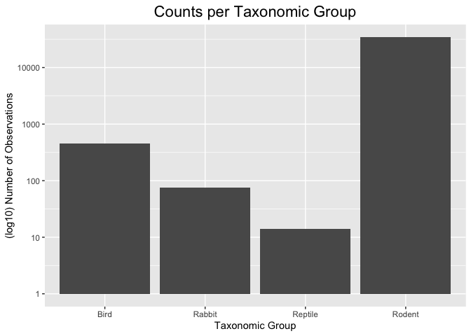
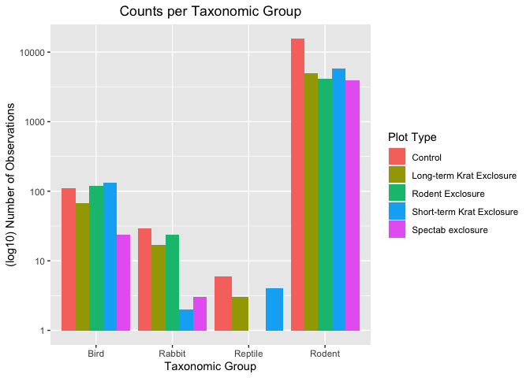
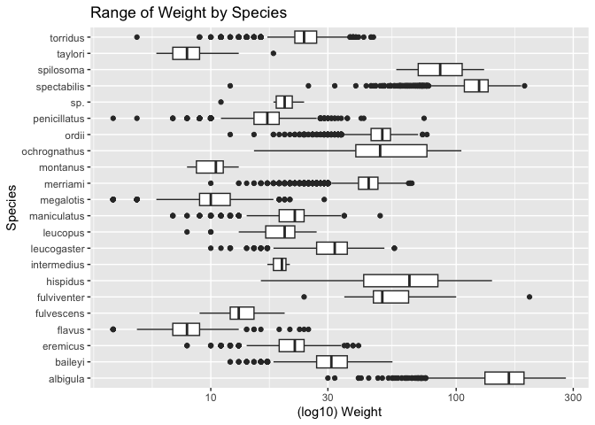
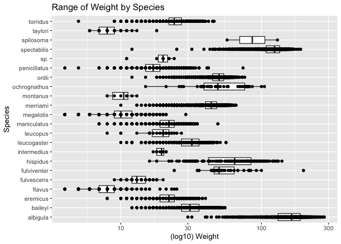
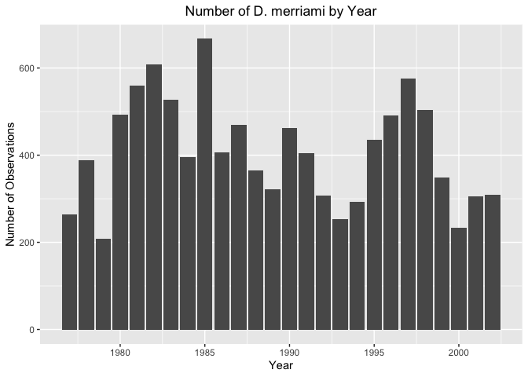
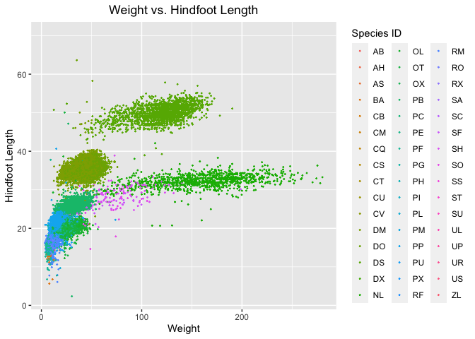
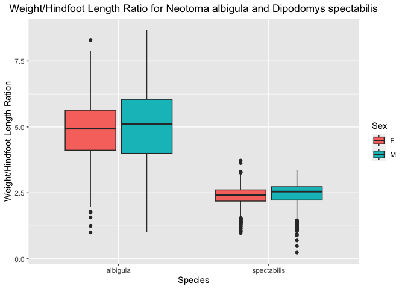
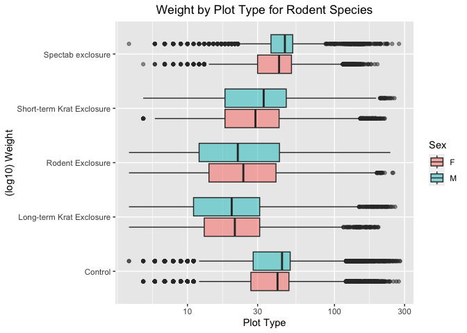

## Instructions
Answer the following questions and complete the exercises in RMarkdown. Please embed all of your code and push your final work to your repository. Your final lab report should be organized, clean, and run free from errors. Remember, you must remove the `#` for the included code chunks to run. Be sure to add your name to the author header above. For any included plots, make sure they are clearly labeled. You are free to use any plot type that you feel best communicates the results of your analysis.  

Make sure to use the formatting conventions of RMarkdown to make your report neat and clean!  

## Load the libraries

```r
library(tidyverse)
library(janitor)
library(naniar)
```

## Desert Ecology
For this assignment, we are going to use a modified data set on [desert ecology](http://esapubs.org/archive/ecol/E090/118/). The data are from: S. K. Morgan Ernest, Thomas J. Valone, and James H. Brown. 2009. Long-term monitoring and experimental manipulation of a Chihuahuan Desert ecosystem near Portal, Arizona, USA. Ecology 90:1708.

```r
deserts <- read_csv("/Users/aminamuhic/Desktop/BIS15W2024_amuhic/lab11/data/surveys_complete.csv") %>% clean_names()
```

```
## Rows: 34786 Columns: 13
## ── Column specification ────────────────────────────────────────────────────────
## Delimiter: ","
## chr (6): species_id, sex, genus, species, taxa, plot_type
## dbl (7): record_id, month, day, year, plot_id, hindfoot_length, weight
## 
## ℹ Use `spec()` to retrieve the full column specification for this data.
## ℹ Specify the column types or set `show_col_types = FALSE` to quiet this message.
```

1. Use the function(s) of your choice to get an idea of its structure, including how NA's are treated. Are the data tidy?  

```r
glimpse(deserts)
```

```
## Rows: 34,786
## Columns: 13
## $ record_id       <dbl> 1, 2, 3, 4, 5, 6, 7, 8, 9, 10, 11, 12, 13, 14, 15, 16,…
## $ month           <dbl> 7, 7, 7, 7, 7, 7, 7, 7, 7, 7, 7, 7, 7, 7, 7, 7, 7, 7, …
## $ day             <dbl> 16, 16, 16, 16, 16, 16, 16, 16, 16, 16, 16, 16, 16, 16…
## $ year            <dbl> 1977, 1977, 1977, 1977, 1977, 1977, 1977, 1977, 1977, …
## $ plot_id         <dbl> 2, 3, 2, 7, 3, 1, 2, 1, 1, 6, 5, 7, 3, 8, 6, 4, 3, 2, …
## $ species_id      <chr> "NL", "NL", "DM", "DM", "DM", "PF", "PE", "DM", "DM", …
## $ sex             <chr> "M", "M", "F", "M", "M", "M", "F", "M", "F", "F", "F",…
## $ hindfoot_length <dbl> 32, 33, 37, 36, 35, 14, NA, 37, 34, 20, 53, 38, 35, NA…
## $ weight          <dbl> NA, NA, NA, NA, NA, NA, NA, NA, NA, NA, NA, NA, NA, NA…
## $ genus           <chr> "Neotoma", "Neotoma", "Dipodomys", "Dipodomys", "Dipod…
## $ species         <chr> "albigula", "albigula", "merriami", "merriami", "merri…
## $ taxa            <chr> "Rodent", "Rodent", "Rodent", "Rodent", "Rodent", "Rod…
## $ plot_type       <chr> "Control", "Long-term Krat Exclosure", "Control", "Rod…
```


```r
head(deserts)
```

```
## # A tibble: 6 × 13
##   record_id month   day  year plot_id species_id sex   hindfoot_length weight
##       <dbl> <dbl> <dbl> <dbl>   <dbl> <chr>      <chr>           <dbl>  <dbl>
## 1         1     7    16  1977       2 NL         M                  32     NA
## 2         2     7    16  1977       3 NL         M                  33     NA
## 3         3     7    16  1977       2 DM         F                  37     NA
## 4         4     7    16  1977       7 DM         M                  36     NA
## 5         5     7    16  1977       3 DM         M                  35     NA
## 6         6     7    16  1977       1 PF         M                  14     NA
## # ℹ 4 more variables: genus <chr>, species <chr>, taxa <chr>, plot_type <chr>
```
_The data looks tidy._

2. How many genera and species are represented in the data? What are the total number of observations? Which species is most/ least frequently sampled in the study?


```r
deserts %>% 
  summarize(n_genera=n_distinct(genus),
            n_species=n_distinct(species))
```

```
## # A tibble: 1 × 2
##   n_genera n_species
##      <int>     <int>
## 1       26        40
```

```r
# number of genera and species represented in the data
```


```r
deserts %>% 
  count()
```

```
## # A tibble: 1 × 1
##       n
##   <int>
## 1 34786
```

```r
# number of total observations in the data
```


```r
deserts %>% 
  count(genus, species, sort = T)
```

```
## # A tibble: 48 × 3
##    genus           species          n
##    <chr>           <chr>        <int>
##  1 Dipodomys       merriami     10596
##  2 Chaetodipus     penicillatus  3123
##  3 Dipodomys       ordii         3027
##  4 Chaetodipus     baileyi       2891
##  5 Reithrodontomys megalotis     2609
##  6 Dipodomys       spectabilis   2504
##  7 Onychomys       torridus      2249
##  8 Perognathus     flavus        1597
##  9 Peromyscus      eremicus      1299
## 10 Neotoma         albigula      1252
## # ℹ 38 more rows
```

```r
# number of observations for each species
```
_Dipodomys erriami is most frequently sampled, while several species tie for the fewest number of observations (Cnemidophorus tigris, Cnemidophorus uniparens, Crotalus scutalatusm, Crotalus viridis, Sceloporus clarki, Spermophilus tereticaudus)._

3. What is the proportion of taxa included in this study? Show a table and plot that reflects this count.


```r
deserts %>% 
  count(taxa)
```

```
## # A tibble: 4 × 2
##   taxa        n
##   <chr>   <int>
## 1 Bird      450
## 2 Rabbit     75
## 3 Reptile    14
## 4 Rodent  34247
```


```r
deserts %>% 
  ggplot(aes(x=taxa)) +
  geom_bar() +
  scale_y_log10() +
  labs(title="Counts per Taxonomic Group",
       x="Taxonomic Group",
       y="(log10) Number of Observations") +
  theme(plot.title = element_text(size = rel(1.5), hjust = 0.5))
```

<!-- -->

4. For the taxa included in the study, use the fill option to show the proportion of individuals sampled by `plot_type.`


```r
deserts %>% 
  ggplot(aes(x=taxa, fill=plot_type)) +
  geom_bar(position = "dodge") +
  scale_y_log10() +
  labs(title="Counts per Taxonomic Group",
       x="Taxonomic Group",
       y="(log10) Number of Observations",
       fill="Plot Type") +
  theme(plot.title = element_text(hjust = 0.5))
```

<!-- -->

5. What is the range of weight for each species included in the study? Remove any observations of weight that are NA so they do not show up in the plot.


```r
deserts %>% 
  filter(weight != "NA") %>% 
  ggplot(aes(x=species, y=weight)) +
  geom_boxplot() + 
  scale_y_log10() +
  coord_flip() +
  labs(title="Range of Weight by Species",
       x="Species",
       y="(log10) Weight")
```

<!-- -->

6. Add another layer to your answer from #5 using `geom_point` to get an idea of how many measurements were taken for each species.


```r
deserts %>% 
  filter(weight != "NA") %>% 
  ggplot(aes(x=species, y=weight)) +
  geom_boxplot() + 
  scale_y_log10() +
  coord_flip() +
  labs(title="Range of Weight by Species",
       x="Species",
       y="(log10) Weight") +
  geom_point(na.rm = T)
```

<!-- -->

7. [Dipodomys merriami](https://en.wikipedia.org/wiki/Merriam's_kangaroo_rat) is the most frequently sampled animal in the study. How have the number of observations of this species changed over the years included in the study?


```r
deserts %>% 
  filter(genus=="Dipodomys" & species=="merriami") %>% 
  group_by(year) %>% 
  count(species)
```

```
## # A tibble: 26 × 3
## # Groups:   year [26]
##     year species      n
##    <dbl> <chr>    <int>
##  1  1977 merriami   264
##  2  1978 merriami   389
##  3  1979 merriami   209
##  4  1980 merriami   493
##  5  1981 merriami   559
##  6  1982 merriami   609
##  7  1983 merriami   528
##  8  1984 merriami   396
##  9  1985 merriami   667
## 10  1986 merriami   406
## # ℹ 16 more rows
```


```r
deserts %>% 
  filter(genus=="Dipodomys" & species=="merriami") %>% 
  group_by(year) %>% 
  count(species) %>% 
  ggplot(aes(x=year, y=n)) +
  geom_col() +
  labs(title="Number of D. merriami by Year",
       x="Year",
       y="Number of Observations") +
  theme(plot.title = element_text(hjust = 0.5))
```

<!-- -->


8. What is the relationship between `weight` and `hindfoot` length? Consider whether or not over plotting is an issue.


```r
deserts %>% 
  ggplot(aes(x=weight, y=hindfoot_length)) +
  geom_jitter(na.rm = T, size=0.25, aes(color=species_id)) +
  labs(title="Weight vs. Hindfoot Length",
       x="Weight",
       y="Hindfoot Length",
       color="Species ID") +
  theme(plot.title = element_text(hjust = 0.5))
```

<!-- -->

9. Which two species have, on average, the highest weight? Once you have identified them, make a new column that is a ratio of `weight` to `hindfoot_length`. Make a plot that shows the range of this new ratio and fill by sex.


```r
deserts %>% 
  filter(weight != "NA") %>% 
  group_by(species) %>% 
  summarize(avg_weight=mean(weight, na.rm = T)) %>% 
  arrange(desc(avg_weight))
```

```
## # A tibble: 22 × 2
##    species      avg_weight
##    <chr>             <dbl>
##  1 albigula          159. 
##  2 spectabilis       120. 
##  3 spilosoma          93.5
##  4 hispidus           65.6
##  5 fulviventer        58.9
##  6 ochrognathus       55.4
##  7 ordii              48.9
##  8 merriami           43.2
##  9 baileyi            31.7
## 10 leucogaster        31.6
## # ℹ 12 more rows
```
_Neotoma albigula and Dipodomys spectabilis have, on average, the largest weights._


```r
deserts %>% 
  filter(species=="albigula" | species=="spectabilis") %>% 
  filter(sex != "NA" & weight != "NA" & hindfoot_length != "NA") %>% 
  mutate(weight_hindfoot = weight / hindfoot_length) %>% 
  ggplot(aes(x=species, y=weight_hindfoot, fill=sex)) +
  geom_boxplot() +
  labs(title="Weight/Hindfoot Length Ratio for Neotoma albigula and Dipodomys spectabilis",
       x="Species",
       y="Weight/Hindfoot Length Ration",
       fill="Sex") +
  theme(plot.title = element_text(hjust = 0.5))
```

<!-- -->


10. Make one plot of your choice! Make sure to include at least two of the aesthetics options you have learned.


```r
deserts %>% 
  filter(taxa=="Rodent") %>% 
  filter(sex != "NA") %>% 
  ggplot(aes(x=plot_type, y=weight, fill=sex)) +
  geom_boxplot(na.rm = T, alpha=0.5) +
  scale_y_log10() +
  coord_flip() +
  theme(plot.title = element_text(hjust = 0.5)) +
  labs(title="Weight by Plot Type for Rodent Species",
       x="(log10) Weight",
       y="Plot Type",
       fill="Sex")
```

<!-- -->

## Push your final code to GitHub!
Please be sure that you check the `keep md` file in the knit preferences. 
