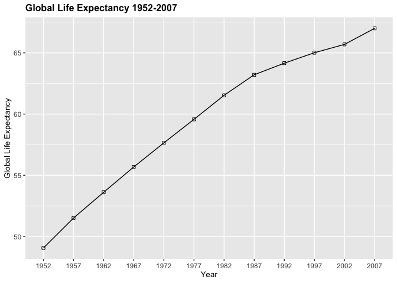
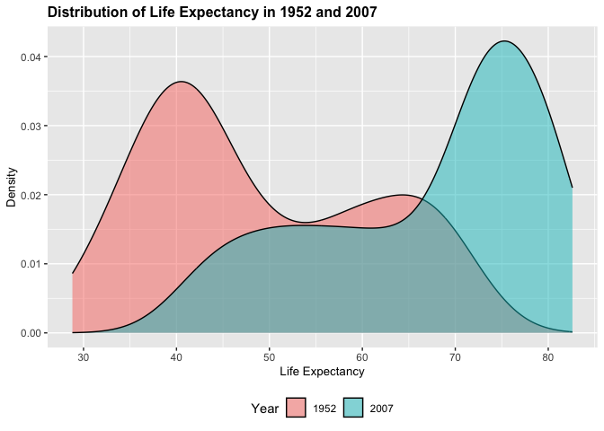
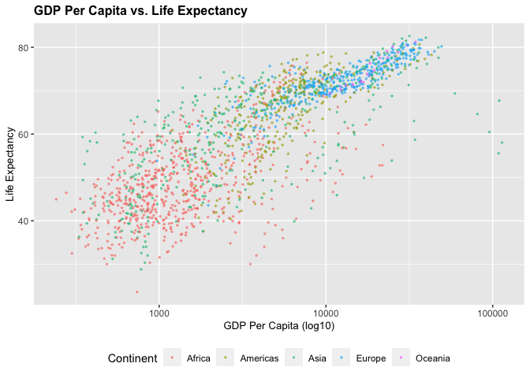
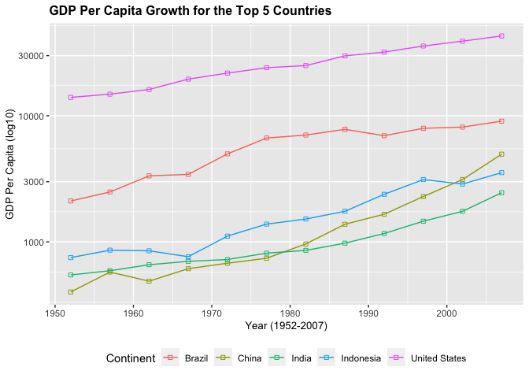

## Instructions
Answer the following questions and complete the exercises in RMarkdown. Please embed all of your code and push your final work to your repository. Your final lab report should be organized, clean, and run free from errors. Remember, you must remove the `#` for the included code chunks to run. Be sure to add your name to the author header above. For any included plots, make sure they are clearly labeled. You are free to use any plot type that you feel best communicates the results of your analysis.  

**In this homework, you should make use of the aesthetics you have learned. It's OK to be flashy!**

Make sure to use the formatting conventions of RMarkdown to make your report neat and clean!  

## Load the libraries

```r
library(tidyverse)
library(janitor)
library(here)
library(naniar)
```


```r
options(scipen = 999)
```

## Resources
The idea for this assignment came from [Rebecca Barter's](http://www.rebeccabarter.com/blog/2017-11-17-ggplot2_tutorial/) ggplot tutorial so if you get stuck this is a good place to have a look.  

## Gapminder
For this assignment, we are going to use the dataset [gapminder](https://cran.r-project.org/web/packages/gapminder/index.html). Gapminder includes information about economics, population, and life expectancy from countries all over the world. You will need to install it before use. This is the same data that we will use for midterm 2 so this is good practice.

```r
#install.packages("gapminder")
library("gapminder")
```


```r
gapminder <- gapminder
```

## Questions
The questions below are open-ended and have many possible solutions. Your approach should, where appropriate, include numerical summaries and visuals. Be creative; assume you are building an analysis that you would ultimately present to an audience of stakeholders. Feel free to try out different `geoms` if they more clearly present your results.  

**1. Use the function(s) of your choice to get an idea of the overall structure of the data frame, including its dimensions, column names, variable classes, etc. As part of this, determine how NAs are treated in the data.** 


```r
glimpse(gapminder)
```

```
## Rows: 1,704
## Columns: 6
## $ country   <fct> "Afghanistan", "Afghanistan", "Afghanistan", "Afghanistan", …
## $ continent <fct> Asia, Asia, Asia, Asia, Asia, Asia, Asia, Asia, Asia, Asia, …
## $ year      <int> 1952, 1957, 1962, 1967, 1972, 1977, 1982, 1987, 1992, 1997, …
## $ lifeExp   <dbl> 28.801, 30.332, 31.997, 34.020, 36.088, 38.438, 39.854, 40.8…
## $ pop       <int> 8425333, 9240934, 10267083, 11537966, 13079460, 14880372, 12…
## $ gdpPercap <dbl> 779.4453, 820.8530, 853.1007, 836.1971, 739.9811, 786.1134, …
```


```r
summary(gapminder)
```

```
##         country        continent        year         lifeExp     
##  Afghanistan:  12   Africa  :624   Min.   :1952   Min.   :23.60  
##  Albania    :  12   Americas:300   1st Qu.:1966   1st Qu.:48.20  
##  Algeria    :  12   Asia    :396   Median :1980   Median :60.71  
##  Angola     :  12   Europe  :360   Mean   :1980   Mean   :59.47  
##  Argentina  :  12   Oceania : 24   3rd Qu.:1993   3rd Qu.:70.85  
##  Australia  :  12                  Max.   :2007   Max.   :82.60  
##  (Other)    :1632                                                
##       pop               gdpPercap       
##  Min.   :     60011   Min.   :   241.2  
##  1st Qu.:   2793664   1st Qu.:  1202.1  
##  Median :   7023596   Median :  3531.8  
##  Mean   :  29601212   Mean   :  7215.3  
##  3rd Qu.:  19585222   3rd Qu.:  9325.5  
##  Max.   :1318683096   Max.   :113523.1  
## 
```


```r
head(gapminder)
```

```
## # A tibble: 6 × 6
##   country     continent  year lifeExp      pop gdpPercap
##   <fct>       <fct>     <int>   <dbl>    <int>     <dbl>
## 1 Afghanistan Asia       1952    28.8  8425333      779.
## 2 Afghanistan Asia       1957    30.3  9240934      821.
## 3 Afghanistan Asia       1962    32.0 10267083      853.
## 4 Afghanistan Asia       1967    34.0 11537966      836.
## 5 Afghanistan Asia       1972    36.1 13079460      740.
## 6 Afghanistan Asia       1977    38.4 14880372      786.
```


**2. Among the interesting variables in gapminder is life expectancy. How has global life expectancy changed between 1952 and 2007?**


```r
gapminder %>% 
  mutate(year=as.factor(year)) %>% 
  group_by(year) %>% 
  summarize(life_exp=mean(lifeExp))
```

```
## # A tibble: 12 × 2
##    year  life_exp
##    <fct>    <dbl>
##  1 1952      49.1
##  2 1957      51.5
##  3 1962      53.6
##  4 1967      55.7
##  5 1972      57.6
##  6 1977      59.6
##  7 1982      61.5
##  8 1987      63.2
##  9 1992      64.2
## 10 1997      65.0
## 11 2002      65.7
## 12 2007      67.0
```


```r
gapminder %>% 
  mutate(year=as.factor(year)) %>% 
  group_by(year) %>% 
  summarize(life_exp=mean(lifeExp)) %>% 
  ggplot(aes(x=year, y=life_exp)) +
  geom_col(color="black", fill="cornflowerblue", alpha =0.4) +
  labs(title="Global Life Expectancy 1952-2007",
       x="Year",
       y="Global Life Expectancy") +
  theme(plot.title = element_text(size=12, face="bold"),
        axis.title.x = element_text(size=10),
        axis.title.y = element_text(size=10))
```

<!-- -->


```r
gapminder %>% 
  mutate(year=as.factor(year)) %>%
  group_by(year) %>% 
  summarize(life_exp=mean(lifeExp)) %>% 
  ggplot(aes(x=year, y=life_exp)) +
  geom_point(shape=0) +
  geom_path(group="keep") +
  labs(title="Global Life Expectancy 1952-2007",
       x="Year",
       y="Global Life Expectancy") +
  theme(plot.title = element_text(size=12, face="bold"),
        axis.title.x = element_text(size=10),
        axis.title.y = element_text(size=10))
```

<!-- -->
**3. How do the distributions of life expectancy compare for the years 1952 and 2007?**


```r
gapminder %>% 
  mutate(year=as.factor(year)) %>% 
  filter(year=="1952" | year=="2007") %>% 
  group_by(year) %>% 
  summarize(min_exp=min(lifeExp),
            med_exp=median(lifeExp),
            max_exp=max(lifeExp))
```

```
## # A tibble: 2 × 4
##   year  min_exp med_exp max_exp
##   <fct>   <dbl>   <dbl>   <dbl>
## 1 1952     28.8    45.1    72.7
## 2 2007     39.6    71.9    82.6
```


```r
gapminder %>% 
  mutate(year=as.factor(year)) %>% 
  filter(year=="1952" | year=="2007") %>% 
  ggplot(aes(x=year, y=lifeExp)) +
  geom_boxplot(fill="cornflowerblue", alpha=0.4) +
  labs(title="Distribution of Life Expectancy in 1952 and 2007",
       x="Year",
       y="Life Expectancy") +
  theme(plot.title = element_text(size=12, face="bold"),
        axis.title.x = element_text(size=10),
        axis.title.y = element_text(size=10))
```

<!-- -->


```r
gapminder %>% 
  mutate(year=as.factor(year)) %>% 
  filter(year=="1952" | year=="2007") %>% 
  ggplot(aes(x=lifeExp, fill=year)) +
  geom_density(alpha=0.5, color="black") +
  labs(title="Distribution of Life Expectancy in 1952 and 2007",
       x="Life Expectancy",
       y="Density",
       fill="Year") +
  theme(plot.title = element_text(size=12, face="bold"),
        axis.title.x = element_text(size=10),
        axis.title.y = element_text(size=10),
        legend.position = "bottom")
```

<!-- -->

**4. Your answer above doesn't tell the whole story since life expectancy varies by region. Make a summary that shows the min, mean, and max life expectancy by continent for all years represented in the data.**


```r
gapminder %>% 
  group_by(continent, year) %>% 
  summarize(min_exp=min(lifeExp),
            mean_exp=mean(lifeExp),
            max_exp=max(lifeExp), .groups = "keep")
```

```
## # A tibble: 60 × 5
## # Groups:   continent, year [60]
##    continent  year min_exp mean_exp max_exp
##    <fct>     <int>   <dbl>    <dbl>   <dbl>
##  1 Africa     1952    30       39.1    52.7
##  2 Africa     1957    31.6     41.3    58.1
##  3 Africa     1962    32.8     43.3    60.2
##  4 Africa     1967    34.1     45.3    61.6
##  5 Africa     1972    35.4     47.5    64.3
##  6 Africa     1977    36.8     49.6    67.1
##  7 Africa     1982    38.4     51.6    69.9
##  8 Africa     1987    39.9     53.3    71.9
##  9 Africa     1992    23.6     53.6    73.6
## 10 Africa     1997    36.1     53.6    74.8
## # ℹ 50 more rows
```

**5. How has life expectancy changed between 1952-2007 for each continent?**


```r
gapminder %>% 
  group_by(continent, year) %>% 
  summarize(life_exp=mean(lifeExp), .groups="keep") %>% 
  ggplot(aes(x=year, y=life_exp, color=continent)) +
  geom_point(shape=0) +
  geom_line() +
  labs(title="Annual Mean Life Expectancy by Continent",
       x="Year",
       y="Mean Life Expectancy",
       color="Continent") +
  theme(plot.title = element_text(size=12, face="bold"),
        axis.title.x = element_text(size=10),
        axis.title.y = element_text(size=10),
        legend.position = "bottom")
```

<!-- -->
**6. We are interested in the relationship between per capita GDP and life expectancy; i.e. does having more money help you live longer?**


```r
gapminder %>% 
  ggplot(aes(x=gdpPercap, y=lifeExp, color=continent)) +
  geom_point(alpha=0.5, size=0.5) +
  scale_x_log10() +
  labs(title="GDP Per Capita vs. Life Expectancy",
       x="GDP Per Capita (log10)",
       y="Life Expectancy",
       color="Continent") +
  theme(plot.title = element_text(size=12, face="bold"),
        axis.title.x = element_text(size=10),
        axis.title.y = element_text(size=10),
        legend.position = "bottom")
```

<!-- -->
_There appears to be a positive correlation between a country's GDP per capita and life expectancy._

**7. Which countries have had the largest population growth since 1952?**


```r
gapminder %>% 
  mutate(year=as.factor(year)) %>% 
  select(country, year, pop) %>% 
  filter(year=="1952" | year=="2007") %>% 
  pivot_wider(names_from = "year",
              names_prefix = "yr_",
              values_from = "pop") %>% 
  mutate(pop_growth = yr_2007 - yr_1952) %>% 
  arrange(desc(pop_growth))
```

```
## # A tibble: 142 × 4
##    country         yr_1952    yr_2007 pop_growth
##    <fct>             <int>      <int>      <int>
##  1 China         556263527 1318683096  762419569
##  2 India         372000000 1110396331  738396331
##  3 United States 157553000  301139947  143586947
##  4 Indonesia      82052000  223547000  141495000
##  5 Brazil         56602560  190010647  133408087
##  6 Pakistan       41346560  169270617  127924057
##  7 Bangladesh     46886859  150448339  103561480
##  8 Nigeria        33119096  135031164  101912068
##  9 Mexico         30144317  108700891   78556574
## 10 Philippines    22438691   91077287   68638596
## # ℹ 132 more rows
```

**8. Use your results from the question above to plot population growth for the top five countries since 1952.**


```r
gapminder %>% 
  filter(country=="China" | country=="India" | country=="United States" | country=="Indonesia" | country=="Brazil") %>% 
  ggplot(aes(x=year, y=pop, color=country)) +
  scale_y_log10() +
  geom_point(shape=0) +
  geom_line() +
  labs(title="Population Growth for the Top 5 Countries",
       x="Year (1952-2007)",
       y="Population (log10)",
       color="Continent") +
  theme(plot.title = element_text(size=12, face="bold"),
        axis.title.x = element_text(size=10),
        axis.title.y = element_text(size=10),
        legend.position = "bottom")
```

<!-- -->
**9. How does per capita GDP growth compare between these same five countries?**


```r
gapminder %>% 
  filter(country=="China" | country=="India" | country=="United States" | country=="Indonesia" | country=="Brazil") %>% 
  ggplot(aes(x=year, y=gdpPercap, color=country)) +
  scale_y_log10() +
  geom_point(shape=0) +
  geom_line() +
  labs(title="GDP Per Capita Growth for the Top 5 Countries",
       x="Year (1952-2007)",
       y="GDP Per Capita (log10)",
       color="Continent") +
  theme(plot.title = element_text(size=12, face="bold"),
        axis.title.x = element_text(size=10),
        axis.title.y = element_text(size=10),
        legend.position = "bottom")
```

<!-- -->

**10. Make one plot of your choice that uses faceting!**


```r
gapminder %>% 
  mutate(year=as.factor(year)) %>% 
  filter(year=="1952" | year=="2007") %>% 
  ggplot(aes(x=continent, y=gdpPercap, fill=continent)) +
  geom_boxplot(alpha=0.5) +
  scale_y_log10() +
  facet_wrap(~year) +
  labs(title="Distribution of GDP Per Capita Across Continents",
       x=NULL,
       y="GDP Per Capita (log10)",
       fill="Continent") +
  theme(plot.title = element_text(size=11, face="bold"),
        axis.text.x = element_text(angle = 60, hjust=1),
        axis.title.y = element_text(size=9),
        legend.position = "bottom")
```

<!-- -->

## Push your final code to GitHub!
Please be sure that you check the `keep md` file in the knit preferences. 
