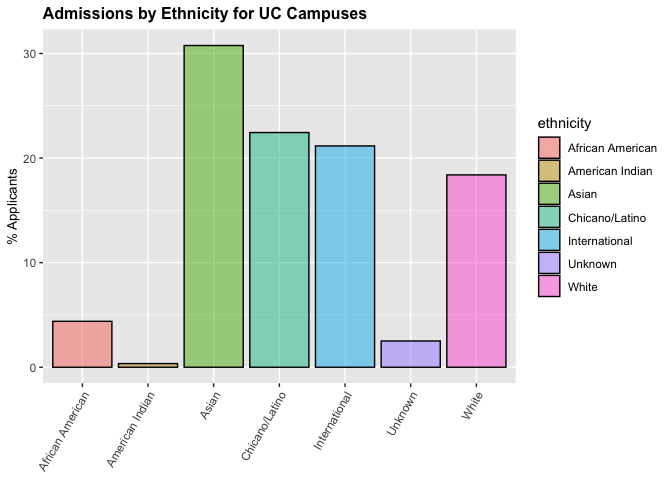
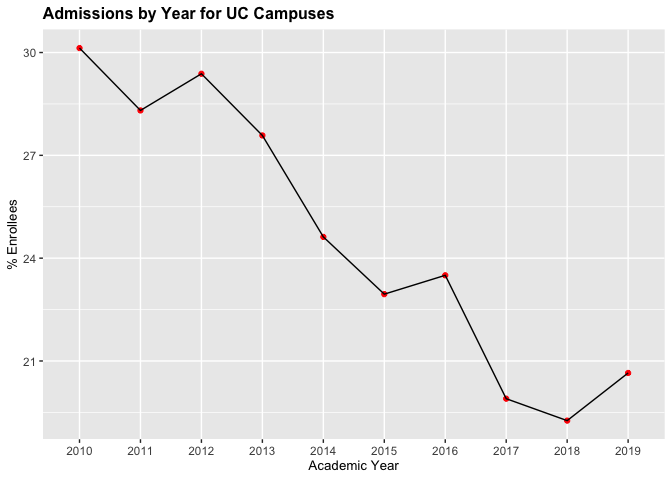

## Instructions
Answer the following questions and complete the exercises in RMarkdown. Please embed all of your code and push your final work to your repository. Your final lab report should be organized, clean, and run free from errors. Remember, you must remove the `#` for the included code chunks to run. Be sure to add your name to the author header above. For any included plots, make sure they are clearly labeled. You are free to use any plot type that you feel best communicates the results of your analysis.  

Make sure to use the formatting conventions of RMarkdown to make your report neat and clean!  

## Libraries

```r
library(tidyverse)
library(shiny)
library(shinydashboard)
library(naniar)
library(janitor)
```

## Data
The data for this assignment come from the [University of California Information Center](https://www.universityofcalifornia.edu/infocenter). Admissions data were collected for the years 2010-2019 for each UC campus. Admissions are broken down into three categories: applications, admits, and enrollees. The number of individuals in each category are presented by demographic. 


```r
UC_admit <- readr::read_csv("/Users/aminamuhic/Desktop/BIS15W2024_amuhic/lab14/data/UC_admit.csv")
```

```
## Rows: 2160 Columns: 6
## ── Column specification ────────────────────────────────────────────────────────
## Delimiter: ","
## chr (4): Campus, Category, Ethnicity, Perc FR
## dbl (2): Academic_Yr, FilteredCountFR
## 
## ℹ Use `spec()` to retrieve the full column specification for this data.
## ℹ Specify the column types or set `show_col_types = FALSE` to quiet this message.
```

**1. Use the function(s) of your choice to get an idea of the overall structure of the data frame, including its dimensions, column names, variable classes, etc. As part of this, determine if there are NA's and how they are treated.**  


```r
glimpse(UC_admit)
```

```
## Rows: 2,160
## Columns: 6
## $ Campus          <chr> "Davis", "Davis", "Davis", "Davis", "Davis", "Davis", …
## $ Academic_Yr     <dbl> 2019, 2019, 2019, 2019, 2019, 2019, 2019, 2019, 2018, …
## $ Category        <chr> "Applicants", "Applicants", "Applicants", "Applicants"…
## $ Ethnicity       <chr> "International", "Unknown", "White", "Asian", "Chicano…
## $ `Perc FR`       <chr> "21.16%", "2.51%", "18.39%", "30.76%", "22.44%", "0.35…
## $ FilteredCountFR <dbl> 16522, 1959, 14360, 24024, 17526, 277, 3425, 78093, 15…
```

```r
summary(UC_admit)
```

```
##     Campus           Academic_Yr     Category          Ethnicity        
##  Length:2160        Min.   :2010   Length:2160        Length:2160       
##  Class :character   1st Qu.:2012   Class :character   Class :character  
##  Mode  :character   Median :2014   Mode  :character   Mode  :character  
##                     Mean   :2014                                        
##                     3rd Qu.:2017                                        
##                     Max.   :2019                                        
##                                                                         
##    Perc FR          FilteredCountFR   
##  Length:2160        Min.   :     1.0  
##  Class :character   1st Qu.:   447.5  
##  Mode  :character   Median :  1837.0  
##                     Mean   :  7142.6  
##                     3rd Qu.:  6899.5  
##                     Max.   :113755.0  
##                     NA's   :1
```


```r
cleanUC_admit <- UC_admit %>% 
  mutate(`Perc FR`=as.numeric(sub("%", "", `Perc FR`))) %>% 
  clean_names()
```


```r
miss_var_summary(UC_admit)
```

```
## # A tibble: 6 × 3
##   variable        n_miss pct_miss
##   <chr>            <int>    <dbl>
## 1 Perc FR              1   0.0463
## 2 FilteredCountFR      1   0.0463
## 3 Campus               0   0     
## 4 Academic_Yr          0   0     
## 5 Category             0   0     
## 6 Ethnicity            0   0
```

**2. The president of UC has asked you to build a shiny app that shows admissions by ethnicity across all UC campuses. Your app should allow users to explore year, campus, and admit category as interactive variables. Use shiny dashboard and try to incorporate the aesthetics you have learned in ggplot to make the app neat and clean.**  

Let's explore the kind of plots we want to see in our app first.

```r
cleanUC_admit %>% 
  filter(ethnicity != "All" & perc_fr != "NA") %>% 
  filter(academic_yr == 2019) %>% # will be interactive
  filter(campus == "Davis") %>%   # will be interactive
  filter(category == "Applicants") %>% # will be interactive
  ggplot(aes(x=ethnicity, y=perc_fr, fill=ethnicity)) +
  geom_col(alpha=0.5, color="black") +
  labs(title="Admissions by Ethnicity for UC Campuses",
       x=NULL,
       y="% Applicants") +
  theme(axis.text.x = element_text(angle=60, hjust=1),
        plot.title = element_text(size = 12, face = "bold"),
        axis.title.x = element_text(size=10),
        axis.title.y = element_text(size=10))
```

<!-- -->

Now that we know what we're trying to represent, let's build the app!


```r
ui <- dashboardPage(
  dashboardHeader(title = "UC Admissions"),
  dashboardSidebar(disable = TRUE),
  dashboardBody(
    
    fluidRow(
      
      box(title = "Plot Options", width = 3, 
          selectInput("x", "Select Year", 
                      choices = unique(cleanUC_admit$academic_yr), 
                      selected = 2010), 
          selectInput("y", "Select Campus", 
                      choices = unique(cleanUC_admit$campus), 
                      selected = "Davis"), 
          selectInput("z", "Select Admit Category", 
                      choices = unique(cleanUC_admit$category), 
                      selected = "Applicants")
      ), #close first box
      
      box(title = "Ethnicity", width = 9,
          plotOutput("plot", width = "800px", height = "600px")
      ) #close second box
    ) #close row
    
  ) #close dashboard body
) #close ui

server <- function(input, output, session) {
  
  session$onSessionEnded(stopApp)
  output$plot <- renderPlot({

    cleanUC_admit %>% filter(ethnicity != "All" & perc_fr != "NA") %>% 
  filter(academic_yr == input$x) %>% 
  filter(campus == input$y) %>% 
  filter(category == input$z) %>%
  ggplot(aes_string(x="ethnicity", y="perc_fr", fill="ethnicity")) +
  geom_col(alpha=0.5, color="black") +
      labs(x=NULL,
       y="% Applicants, Admits, or Enrollees",
       fill="Ethnicity") +
  theme(axis.text.x = element_text(angle=60, hjust=1),
        axis.title.x = element_text(size=10),
        axis.title.y = element_text(size=10))
    
    })

}

shinyApp(ui, server)
```

```{=html}
<div style="width: 100% ; height: 400px ; text-align: center; box-sizing: border-box; -moz-box-sizing: border-box; -webkit-box-sizing: border-box;" class="muted well">Shiny applications not supported in static R Markdown documents</div>
```

**3. Make alternate version of your app above by tracking enrollment at a campus over all of the represented years while allowing users to interact with campus, category, and ethnicity.**

Again, let's make an example figure so we can get an idea of the type of figure we want to see in our eventual app.

```r
cleanUC_admit %>% 
  mutate(academic_yr=as.factor(academic_yr)) %>% 
  filter(campus == "Davis") %>% # will be variable
  filter(category == "Enrollees") %>% # will be variable
  filter(ethnicity == "White") %>% # will be variable
  ggplot(aes(x=academic_yr, y=perc_fr)) +
  geom_point(color="red") +
  geom_path(group="keep") +
  labs(title="Admissions by Year for UC Campuses",
       x="Academic Year",
       y="% Enrollees") +
  theme(plot.title = element_text(size = 12, face = "bold"),
        axis.title.x = element_text(size=10),
        axis.title.y = element_text(size=10))
```

<!-- -->


```r
ui <- dashboardPage(
  dashboardHeader(title = "UC Admissions"),
  dashboardSidebar(disable = TRUE),
  dashboardBody(
    
    fluidRow(
      
      box(title = "Plot Options", width = 3, 
          selectInput("x", "Select Campus", 
                      choices = unique(cleanUC_admit$campus), 
                      selected = "Davis"), 
          selectInput("y", "Select Category", 
                      choices = unique(cleanUC_admit$category), 
                      selected = "Applicants"), 
          selectInput("z", "Select Admit Ethnicity", 
                      choices = unique(cleanUC_admit$ethnicity), 
                      selected = "International")
      ), #close first box
      
      box(title = "Yearly Trends", width = 9,
          plotOutput("plot", width = "800px", height = "600px")
      ) #close second box
    ) #close row
    
  ) #close dashboard body
) #close ui

server <- function(input, output, session) {
  
  session$onSessionEnded(stopApp)
  output$plot <- renderPlot({

    cleanUC_admit %>% mutate(academic_yr=as.factor(academic_yr)) %>% filter(ethnicity != "All" & perc_fr != "NA") %>% 
  filter(campus == input$x) %>% 
  filter(category == input$y) %>% 
  filter(ethnicity == input$z) %>%
  ggplot(aes_string(x="academic_yr", y="perc_fr")) +
  geom_point(color="red") +
  geom_path(group="keep") +
      labs(x="Academic Year",
       y="% Applicants, Admits, or Enrollees") +
  theme(axis.title.x = element_text(size=10),
        axis.title.y = element_text(size=10))
    
    })

}

shinyApp(ui, server)
```

```{=html}
<div style="width: 100% ; height: 400px ; text-align: center; box-sizing: border-box; -moz-box-sizing: border-box; -webkit-box-sizing: border-box;" class="muted well">Shiny applications not supported in static R Markdown documents</div>
```
## Push your final code to GitHub!
Please be sure that you check the `keep md` file in the knit preferences. 
