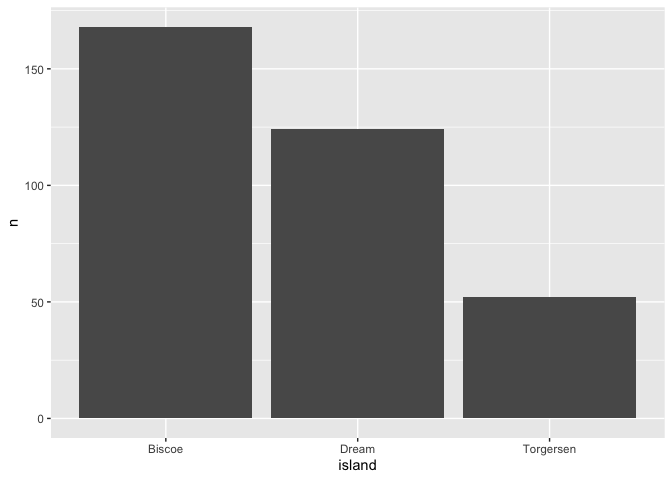
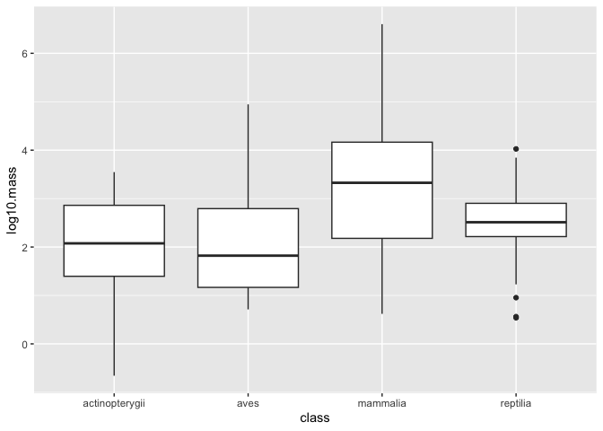

## Learning Goals
*At the end of this exercise, you will be able to:*    
1. Produce boxplots using `ggplot.`  
2. Customize labels on axes using `labs` and `themes`.  
3. Use `color`, `fill`, and `group` to customize plots and improve overall aesthetics.  

##Resources  
- [ggplot2 cheatsheet](https://www.rstudio.com/wp-content/uploads/2015/03/ggplot2-cheatsheet.pdf)  
- [`ggplot` themes](https://ggplot2.tidyverse.org/reference/ggtheme.html)  
- [Rebecca Barter `ggplot` Tutorial](http://www.rebeccabarter.com/blog/2017-11-17-ggplot2_tutorial/)  

## Load the libraries

```r
library(tidyverse)
library(skimr)
library(janitor)
library(palmerpenguins)
```

## Review
Now that you have been introduced to `ggplot`, let's practice a few more plot types. Remember that plots are built in layers: **plot= data + geom_ + aesthetics**. We have to specify each of these in order for a plot to be produced. If you get stuck, it is often helpful to stop and make a quick sketch of what you want or expect to see on a piece of scratch paper.  

Let's review using the `penguins` data. First, get an idea of the structure: Are the data tidy? Are there NA's? Are the variables discrete, categorical, or continuous?

```r
penguins
```

```
## # A tibble: 344 × 8
##    species island    bill_length_mm bill_depth_mm flipper_length_mm body_mass_g
##    <fct>   <fct>              <dbl>         <dbl>             <int>       <int>
##  1 Adelie  Torgersen           39.1          18.7               181        3750
##  2 Adelie  Torgersen           39.5          17.4               186        3800
##  3 Adelie  Torgersen           40.3          18                 195        3250
##  4 Adelie  Torgersen           NA            NA                  NA          NA
##  5 Adelie  Torgersen           36.7          19.3               193        3450
##  6 Adelie  Torgersen           39.3          20.6               190        3650
##  7 Adelie  Torgersen           38.9          17.8               181        3625
##  8 Adelie  Torgersen           39.2          19.6               195        4675
##  9 Adelie  Torgersen           34.1          18.1               193        3475
## 10 Adelie  Torgersen           42            20.2               190        4250
## # ℹ 334 more rows
## # ℹ 2 more variables: sex <fct>, year <int>
```

In a previous lab, we asked how many penguins were measured on each island.

```r
penguins %>% 
  count(island)
```

```
## # A tibble: 3 × 2
##   island        n
##   <fct>     <int>
## 1 Biscoe      168
## 2 Dream       124
## 3 Torgersen    52
```

Make this output more visual by adding a plot...

```r
penguins %>% 
  count(island) %>% 
  ggplot(aes(x=island, y=n))+
  geom_col()
```

<!-- -->

## Practice
1. What if we wanted a plot that showed the number of measured penguins for each species?


```r
penguins %>% 
  count(species)
```

```
## # A tibble: 3 × 2
##   species       n
##   <fct>     <int>
## 1 Adelie      152
## 2 Chinstrap    68
## 3 Gentoo      124
```


```r
penguins %>% 
  count(island) %>% 
  ggplot(aes(x=island, y=n)) +
  geom_col()
```

<!-- -->

2. How about average bill length by sex?


```r
penguins %>% 
  filter(sex != "NA") %>% 
  group_by(sex) %>% 
  summarize(bill_length=mean(bill_length_mm))
```

```
## # A tibble: 2 × 2
##   sex    bill_length
##   <fct>        <dbl>
## 1 female        42.1
## 2 male          45.9
```


```r
penguins %>% 
  filter(sex != "NA") %>% 
  group_by(sex) %>% 
  summarize(bill_length=mean(bill_length_mm, na.rm = TRUE)) %>% ggplot(aes(x=sex, y=bill_length)) +
  geom_col()
```

<!-- -->

## Box Plots
For the next series of examples, we will use the `homerange` data.  **Database of vertebrate home range sizes.**   

Reference: Tamburello N, Cote IM, Dulvy NK (2015) Energy and the scaling of animal space use. The American Naturalist 186(2):196-211. http://dx.doi.org/10.1086/682070.  
Data: http://datadryad.org/resource/doi:10.5061/dryad.q5j65/1  


```r
homerange <- read_csv("data/Tamburelloetal_HomeRangeDatabase.csv")
```

Boxplots help us visualize a range of values. So, on the x-axis we typically have something categorical and the y-axis is the range. In the case below, we are plotting `log10.mass` by taxonomic class in the `homerange` data. `geom_boxplot()` is the geom type for a standard box plot. The center line in each box represents the median, not the mean.

Let's look at the variable `log10.mass` grouped by taxonomic class.

```r
homerange %>% 
  group_by(class) %>% 
  summarize(min_log10.mass=min(log10.mass),
            max_log10.mass=max(log10.mass),
            median_log10.mass=median(log10.mass))
```

```
## # A tibble: 4 × 4
##   class          min_log10.mass max_log10.mass median_log10.mass
##   <chr>                   <dbl>          <dbl>             <dbl>
## 1 actinopterygii         -0.658           3.55              2.08
## 2 aves                    0.712           4.95              1.82
## 3 mammalia                0.620           6.60              3.33
## 4 reptilia                0.539           4.03              2.51
```


```r
homerange %>% 
  ggplot(aes(x = class, y = log10.mass)) +
  geom_boxplot()
```

<!-- -->

## Practice
1. There are more herbivores than carnivores in the homerange data, but how do their masses compare? Make a summary and boxplot that compares their masses. Use `log10.mass`.


```r
homerange %>% 
  group_by(trophic.guild) %>% 
  summarize(min_mass=min(log10.mass),
            med_mass=median(log10.mass),
            max_mass=max(log10.mass))
```

```
## # A tibble: 2 × 4
##   trophic.guild min_mass med_mass max_mass
##   <chr>            <dbl>    <dbl>    <dbl>
## 1 carnivore       -0.658     2.28     5.05
## 2 herbivore        0.398     2.97     6.60
```


```r
homerange %>% 
  ggplot(aes(x=trophic.guild, y=log10.mass)) +
  geom_boxplot()
```

<!-- -->

2. Have a closer look at carnivorous mammals. Summarize the range of log10.mass by family.


```r
homerange %>% 
  filter(trophic.guild == "carnivore") %>%
  filter(taxon == "mammals") %>% 
  group_by(family) %>% 
  summarize(min_mass=min(log10.mass),
            med_mass=median(log10.mass),
            max_mass=max(log10.mass))
```

```
## # A tibble: 18 × 4
##    family          min_mass med_mass max_mass
##    <chr>              <dbl>    <dbl>    <dbl>
##  1 canidae            3.32     3.65      4.44
##  2 chrysochloridae    1.36     2.00      2.64
##  3 cricetidae         1.34     1.39      1.44
##  4 dasyuridae         1.36     2.24      3.45
##  5 didelphidae        1.29     1.38      1.46
##  6 erinaceidae        2.47     2.69      2.90
##  7 eupleridae         3.98     3.98      3.98
##  8 felidae            3.40     4.05      5.05
##  9 herpestidae        2.45     3.45      3.56
## 10 hyanidae           4        4         4   
## 11 macroscelididae    1.76     2.30      2.73
## 12 mustelidae         1.94     2.96      4.33
## 13 peramelidae        2.59     2.74      2.89
## 14 soricidae          0.620    0.940     1.15
## 15 tachyglossidae     2.41     2.41      2.41
## 16 talpidae           1.68     1.95      2.01
## 17 ursidae            4.99     4.99      4.99
## 18 viverridae         3.24     3.33      3.90
```

3. Now use a boxplot to visualize the range of log10.mass by family of mammalian carnivore.


```r
homerange %>% 
  filter(trophic.guild == "carnivore") %>% 
  filter(taxon == "mammals") %>% 
  ggplot(aes(x=family, y=log10.mass)) +
  geom_boxplot()+
  coord_flip()
```

<!-- -->

## Wrap-up  
Please review the learning goals and be sure to use the code here as a reference when completing the homework.  
-->[Home](https://jmledford3115.github.io/datascibiol/)
