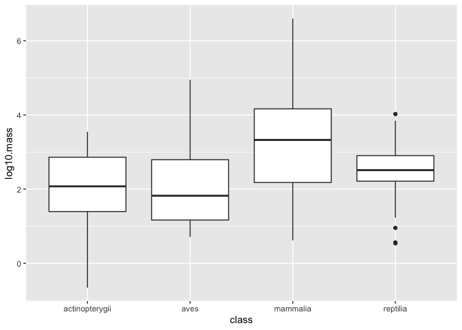
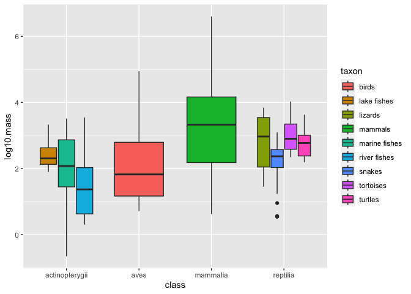
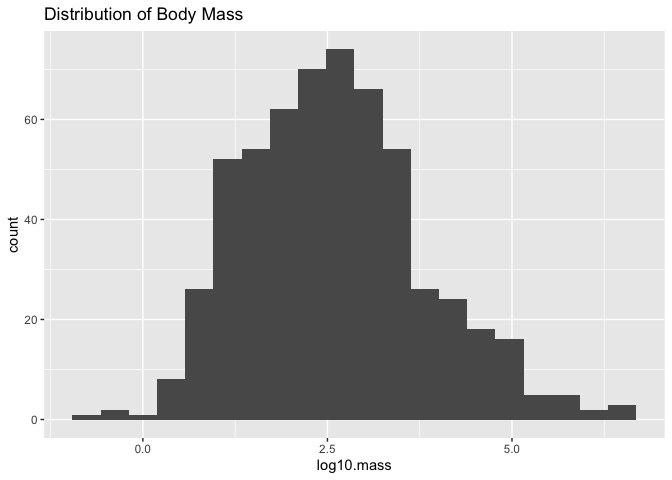
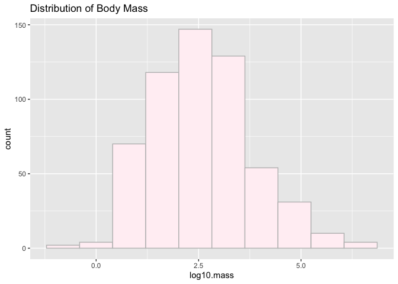
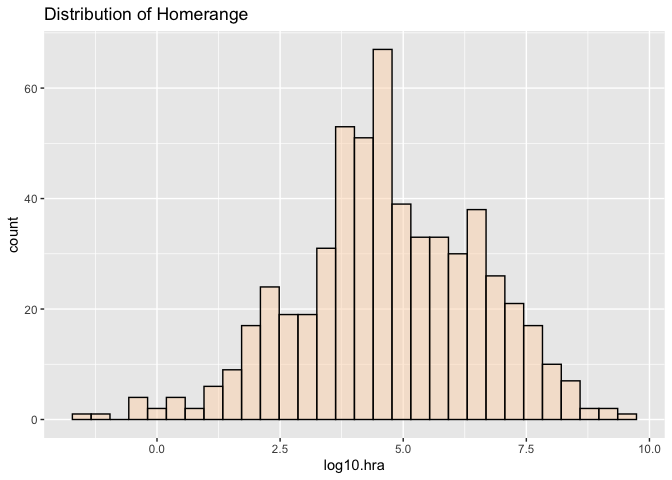
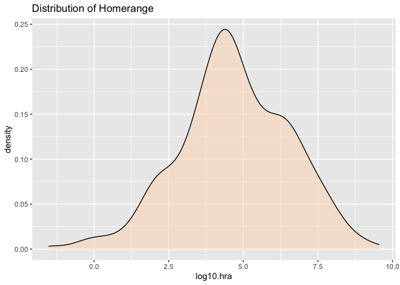
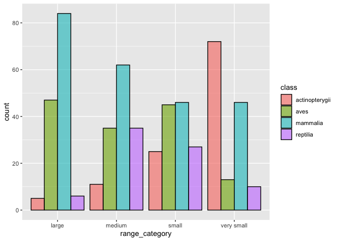

## Learning Goals
*At the end of this exercise, you will be able to:*    
1. Build histograms and density plots.
2. Adjust colors using R's built-in color options.  
3. Create new categories with `case_when()` and use those categories to build plots.  
4. Build line plots.  

## Resources
- [ggplot2 cheatsheet](https://www.rstudio.com/wp-content/uploads/2015/03/ggplot2-cheatsheet.pdf)
- [R for Data Science](https://r4ds.had.co.nz/)
- [R Cookbook](http://www.cookbook-r.com/)
- [`ggplot` themes](https://ggplot2.tidyverse.org/reference/ggtheme.html)
- [Rebecca Barter `ggplot` Tutorial](http://www.rebeccabarter.com/blog/2017-11-17-ggplot2_tutorial/)
- [R Color Brewer](http://colorbrewer2.org/#type=sequential&scheme=BuGn&n=3)

## Install `RColorBrewer`, `paletteer`, and `ggthemes`
`RColorBrewer` and `paletteer` are helpful in selecting palettes of color that work with your data. Please install these now, we will work with them in part 2 of today's lab.

```r
#install.packages("RColorBrewer")
#install.packages("paletteer")
#install.packages("ggthemes")
```

## Load the libraries

```r
library(tidyverse)
library(RColorBrewer)
library(paletteer)
library(janitor)
```


```r
options(scipen=999) #cancels the use of scientific notation for the session
```

## Data
For this tutorial, we will use two data sets.  

[Desert ecology](http://esapubs.org/archive/ecol/E090/118/). The data are from: S. K. Morgan Ernest, Thomas J. Valone, and James H. Brown. 2009. Long-term monitoring and experimental manipulation of a Chihuahuan Desert ecosystem near Portal, Arizona, USA. Ecology 90:1708.  

```r
deserts <- read_csv("data/surveys_complete.csv")
```

[Homerange](http://datadryad.org/resource/doi:10.5061/dryad.q5j65/1). The data are from: Tamburello N, Cote IM, Dulvy NK (2015) Energy and the scaling of animal space use. The American Naturalist 186(2):196-211. http://dx.doi.org/10.1086/682070.  

```r
homerange <- read_csv("data/Tamburelloetal_HomeRangeDatabase.csv", na = c("", "NA", "\\"))
```

## Review
1. Use the `homerange` data to make a boxplot that shows the range of `log10.mass` by taxonomic class.

```r
homerange %>% 
  ggplot(aes(x=class, y=log10.mass)) +
  geom_boxplot()
```

<!-- -->

2. Now, add a layer to this plot that fills color for each box by taxonomic class

```r
homerange %>% 
  ggplot(aes(x=class, y=log10.mass, fill=class)) +
  geom_boxplot()
```

<!-- -->

3. Use `group` to show the range of `log10.mass` by taxon.

```r
homerange %>% 
  ggplot(aes(x=class, y=log10.mass, group=taxon)) +
  geom_boxplot()
```

<!-- -->

4. Use `fill` to show the range of `log10.mass` by taxon with color codes.

```r
homerange %>% 
  ggplot(aes(x=class, y=log10.mass, fill=taxon)) +
  geom_boxplot()
```

<!-- -->

## Line plots
Line plots are great when you need to show changes over time. Here we look at the number of samples for species DM and DS over the years represented in the `deserts` data. This takes some careful thought- we want to know how sampling has changed over time for these two species.    

Let's start by making a clear x and y so we know what we are going to plot.
_Example of a hard MT2 problem._

```r
deserts %>% 
  filter(species_id == "DM" | species_id == "DS") %>% 
  mutate(year=as.factor(year)) %>% # do this
  group_by(year, species_id) %>% 
  summarize(n=n(), .groups = 'keep') %>% 
  pivot_wider(names_from = species_id, # more readable
              values_from = n)
```

```
## # A tibble: 26 × 3
## # Groups:   year [26]
##    year     DM    DS
##    <fct> <int> <int>
##  1 1977    264    98
##  2 1978    389   320
##  3 1979    209   204
##  4 1980    493   346
##  5 1981    559   354
##  6 1982    609   354
##  7 1983    528   280
##  8 1984    396    76
##  9 1985    667    98
## 10 1986    406    88
## # ℹ 16 more rows
```


```r
deserts %>% 
  filter(species_id == "DM" | species_id == "DS") %>% 
  mutate(year=as.factor(year)) %>% # do this
  group_by(year, species_id) %>% 
  summarize(n=n(), .groups = 'keep') %>% 
  ggplot(aes(x=year, y=n, group=species_id, color=species_id)) +
  geom_line() +
  geom_point(shape=2) + # you can experiment with this
  theme(axis.text.x = element_text(angle=60, hjust = 1)) +
  labs(title="Number of Samples for Species DM & DS",
       x="Year",
       y="n")
```

<!-- -->

## Histograms
Histograms are frequently used by biologists; they show the distribution of continuous variables. As students, you have seen histograms of grade distributions. A histogram `bins` the data and you specify the number of bins that encompass a range of observations. For something like grades, this is easy because the number of bins corresponds to the grades A-F. By default, R uses a formula to calculate the number of bins but some adjustment may be required.  

What does the distribution of body mass look like in the `homerange` data?

```r
homerange %>% 
  ggplot(aes(x = log10.mass)) +
  geom_histogram(bins=20)+ #we can adjust the number of bins with the bins argument
  labs(title = "Distribution of Body Mass")
```

<!-- -->

Let's play with the colors. This shows all 657 of R's built-in colors. Notice that `color` and `fill` do different things!

```r
#grDevices::colors()
```

Let's rebuild the histogram, but this time we will specify the color and fill. Do a little experimentation on your own with the different colors.

```r
homerange %>% 
  ggplot(aes(x = log10.mass)) +
  geom_histogram(color = "grey", fill = "lavenderblush", bins=10)+
  labs(title = "Distribution of Body Mass")
```

<!-- -->

## Density plots  
Density plots are similar to histograms but they use a smoothing function to make the distribution more even and clean looking. They do not use bins.

```r
homerange %>% 
  ggplot(aes(x = log10.mass)) + # only need to specify 1 variable
  geom_density(fill="deepskyblue4", alpha  =0.4, color = "black")+ #alpha is the transparency
  labs(title = "Distribution of Body Mass")
```

<!-- -->

I like to see both the histogram and the density curve so I often plot them together. Note that I assign the density plot a different color.

```r
homerange %>% 
  ggplot(aes(x=log10.mass)) +
  geom_histogram(aes(y = after_stat(density)), fill = "deepskyblue4", alpha = 0.4, color = "black")+
  geom_density(color = "red")+
  labs(title = "Distribution of Body Mass")
```

<!-- -->

## Practice
1. Make a histogram of `log10.hra`. Make sure to add a title.

```r
homerange %>% 
  ggplot(aes(x=log10.hra)) +
  geom_histogram(color="black", fill="peachpuff", alpha=0.5) +
  labs(title="Distribution of Homerange")
```

```
## `stat_bin()` using `bins = 30`. Pick better value with `binwidth`.
```

<!-- -->

2. Now plot the same variable using `geom_density()`.

```r
homerange %>% 
  ggplot(aes(x=log10.hra)) +
  geom_density(color="black", fill="peachpuff", alpha=0.5) +
  labs(title="Distribution of Homerange")
```

<!-- -->

3. Combine them both!

```r
homerange %>% 
  ggplot(aes(x=log10.hra)) +
  geom_histogram(aes(y=after_stat(density)), fill="peachpuff", color="black", alpha=0.5) +
  geom_density(color="red") +
  labs(title="Distribution of Homerange")
```

```
## `stat_bin()` using `bins = 30`. Pick better value with `binwidth`.
```

<!-- -->

## Create Categories with mutate and case_when()
`case_when()` is a very handy function from `dplyr` which allows us to calculate a new variable from other variables. We use `case_when()` within `mutate()` to do this.`case_when()` allows us to specify multiple conditions. Let's reclassify the body mass variable into a new factor variable with small, medium, and large animals. In this case, we are making a continuous variable into a categorical variable.  

```r
homerange %>% 
  select(log10.mass) %>% 
  summarize(min=min(log10.mass),
            max=max(log10.mass))
```

```
## # A tibble: 1 × 2
##      min   max
##    <dbl> <dbl>
## 1 -0.658  6.60
```


```r
summary(homerange$log10.mass)
```

```
##    Min. 1st Qu.  Median    Mean 3rd Qu.    Max. 
## -0.6576  1.6990  2.5185  2.5947  3.3324  6.6021
```


```r
homerange %>% 
  mutate(mass_category=case_when(log10.mass<=1.75 ~ "small",
                                 log10.mass>1.75 & log10.mass<=2.75 ~ "medium",
                                 log10.mass>2.75 ~ "large"))
```

```
## # A tibble: 569 × 25
##    taxon        common.name class order family genus species primarymethod N    
##    <chr>        <chr>       <chr> <chr> <chr>  <chr> <chr>   <chr>         <chr>
##  1 lake fishes  american e… acti… angu… angui… angu… rostra… telemetry     16   
##  2 river fishes blacktail … acti… cypr… catos… moxo… poecil… mark-recaptu… <NA> 
##  3 river fishes central st… acti… cypr… cypri… camp… anomal… mark-recaptu… 20   
##  4 river fishes rosyside d… acti… cypr… cypri… clin… fundul… mark-recaptu… 26   
##  5 river fishes longnose d… acti… cypr… cypri… rhin… catara… mark-recaptu… 17   
##  6 river fishes muskellunge acti… esoc… esoci… esox  masqui… telemetry     5    
##  7 marine fish… pollack     acti… gadi… gadid… poll… pollac… telemetry     2    
##  8 marine fish… saithe      acti… gadi… gadid… poll… virens  telemetry     2    
##  9 marine fish… lined surg… acti… perc… acant… acan… lineat… direct obser… <NA> 
## 10 marine fish… orangespin… acti… perc… acant… naso  litura… telemetry     8    
## # ℹ 559 more rows
## # ℹ 16 more variables: mean.mass.g <dbl>, log10.mass <dbl>,
## #   alternative.mass.reference <chr>, mean.hra.m2 <dbl>, log10.hra <dbl>,
## #   hra.reference <chr>, realm <chr>, thermoregulation <chr>, locomotion <chr>,
## #   trophic.guild <chr>, dimension <dbl>, preymass <dbl>, log10.preymass <dbl>,
## #   PPMR <dbl>, prey.size.reference <chr>, mass_category <chr>
```

```r
# important for MT2!
```

Here we check how the newly created body mass categories compare across `trophic.guild`. 

```r
homerange %>% 
  mutate(mass_category=case_when(log10.mass<=1.75 ~ "small",
                                 log10.mass>1.75 & log10.mass<=2.75 ~ "medium",
                                 log10.mass>2.75 ~ "large")) %>% 
  ggplot(aes(x=mass_category, fill=trophic.guild)) +
  geom_bar(position="dodge")
```

<!-- -->

## Practice
1. Use case_when() to make a new column `range_category` that breaks down `log10.hra` into very small, small, medium, and large classes based on quartile.

```r
summary(homerange$log10.hra)
```

```
##    Min. 1st Qu.  Median    Mean 3rd Qu.    Max. 
##  -1.523   3.653   4.595   4.709   6.016   9.550
```


```r
#install.packages("gtools")
library(gtools)
```


```r
quartiles <- quantcut(homerange$log10.hra)
table(quartiles)
```

```
## quartiles
## [-1.52,3.65]  (3.65,4.59]  (4.59,6.02]  (6.02,9.55] 
##          143          142          142          142
```


```r
homerange %>% 
  mutate(range_category=case_when(log10.hra<3.65 ~ "very small",
                                  log10.hra>=3.65 & log10.hra<4.59 ~ "small",
                                  log10.hra>=4.59 & log10.hra<6.02 ~ "medium",
                                  log10.hra>=6.02 ~ "large"))
```

```
## # A tibble: 569 × 25
##    taxon        common.name class order family genus species primarymethod N    
##    <chr>        <chr>       <chr> <chr> <chr>  <chr> <chr>   <chr>         <chr>
##  1 lake fishes  american e… acti… angu… angui… angu… rostra… telemetry     16   
##  2 river fishes blacktail … acti… cypr… catos… moxo… poecil… mark-recaptu… <NA> 
##  3 river fishes central st… acti… cypr… cypri… camp… anomal… mark-recaptu… 20   
##  4 river fishes rosyside d… acti… cypr… cypri… clin… fundul… mark-recaptu… 26   
##  5 river fishes longnose d… acti… cypr… cypri… rhin… catara… mark-recaptu… 17   
##  6 river fishes muskellunge acti… esoc… esoci… esox  masqui… telemetry     5    
##  7 marine fish… pollack     acti… gadi… gadid… poll… pollac… telemetry     2    
##  8 marine fish… saithe      acti… gadi… gadid… poll… virens  telemetry     2    
##  9 marine fish… lined surg… acti… perc… acant… acan… lineat… direct obser… <NA> 
## 10 marine fish… orangespin… acti… perc… acant… naso  litura… telemetry     8    
## # ℹ 559 more rows
## # ℹ 16 more variables: mean.mass.g <dbl>, log10.mass <dbl>,
## #   alternative.mass.reference <chr>, mean.hra.m2 <dbl>, log10.hra <dbl>,
## #   hra.reference <chr>, realm <chr>, thermoregulation <chr>, locomotion <chr>,
## #   trophic.guild <chr>, dimension <dbl>, preymass <dbl>, log10.preymass <dbl>,
## #   PPMR <dbl>, prey.size.reference <chr>, range_category <chr>
```

2. Make a plot that shows how many and which taxonomic classes are represented in each `range_category`.   

```r
homerange %>% 
  mutate(range_category=case_when(log10.hra<3.65 ~ "very small",
                                  log10.hra>=3.65 & log10.hra<4.59 ~ "small",
                                  log10.hra>=4.59 & log10.hra<6.02 ~ "medium",
                                  log10.hra>=6.02 ~ "large")) %>% 
  ggplot(aes(x=range_category, fill=class)) +
  geom_bar(position = "dodge", alpha=0.6, color="black")
```

<!-- -->

3. Isolate the small `range_category` and plot the range of `log10.mass` by taxonomic class.

```r
homerange %>% 
  mutate(range_category=case_when(log10.hra<3.65 ~ "very small",
                                  log10.hra>=3.65 & log10.hra<4.59 ~ "small",
                                  log10.hra>=4.59 & log10.hra<6.02 ~ "medium",
                                  log10.hra>=6.02 ~ "large")) %>% 
  filter(range_category=="small") %>% 
  ggplot(aes(x=class, y=log10.mass, fill=class)) +
  geom_boxplot()
```

<!-- -->

## That's it, let's take a break!  

-->[Home](https://jmledford3115.github.io/datascibiol/)
